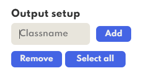

# Classification in vision AI

You can select `Classification` option on the left-panel of the app, and get to add new classes for your AI projects.

## Guidelines

- All created classnames are case-insensitive and converted to lowercase characters
- Only alphanumeric characters are accepted
- You get to remove selected or remove all created classnames on left-panel
- You can assign a class to an imported file by clicking labelled `Edit classname` button in app's bottombar.

## Annotations

Each imported file has its designated `idx`<integer> that's generated when doing file imports. This field is unique to a file and can be seen beside the file's name on the app's left-panel. A single imported file has its own `json` file containing annotation that is related with selected `task`. You can find a specific file annotation of a selected task under `/path/of/project/$task/classification/`. If a file's `idx` is `0` then its `json` file will be named, `0.json`.

An example path of a file's annotation `DriveX:/User/name/Documents/Annovision-Output/default/classification/0.json`.

> ## Note
>
> When first time adding classname, `classes.json` file is created under the same folder with the file annotations.
> All classes added/removed for a selected project are saved under `classes.json`

## Annotation format

**Sample contents of `classes.json`**

```json
{
  "classes": ["human", "car"]
}
```

**Sample contents of an annotation file, named `1.json`**

> ## Note
>
> The previously mentioned `idx` for this file example, is equal to `1`

```json
{
  "file": "sample.png",
  "path": "x:/sample/path",
  "projectId": 0,
  "projectName": "Default",
  "assigned": ["car"]
}
```

## Screenshot

- **Left-panel when `Classification` task is selected**


