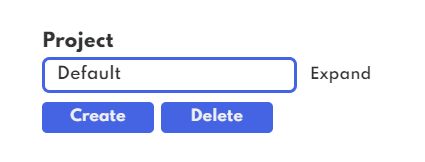
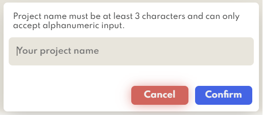

# Projects in Annovision

Managing data for any vision AI task has never been this easy with this application, yet it's all free.

## Guides in creating and for existing projects

- Project names are case-insensitive, saving a project converts all name input to lowercase.
- Project name must be unique and could prompt error when trying to create w/ names that already exist.
- Only alphanumeric characters are accepted as project name and must be atleast 3 characters long.
- All available projects can be deleted, except for the `Default` project
- All available projects are customizable in terms of files that can be imported/added
- A project contains all available vision AI tasks (e.g. `Classification`, `Region-based` or `Segmentation`) and lets you switch in-between
- Importing files that are already in project's file list are ignored.
- When creating a project, the app doesn't directly switch you to that project, you need to click `Expand` on left-panel and manually select it.

## Output

All application output for Windows(only-supported) platform sits under user's documents folder `(e.g. X:/User/name/Documents/Annovision-Output)`.
The app's core is using python given result in terms of locating **Drive:/Users/path/** thru:

```
os.path.expanduser('~')
```

`Annovision-Output` named folder contains all of your created project folders named with your project name/title in lowercase format.
Annovision's output folder can also be shown through the app's right-panel button.

## Screenshot

- **Left panel project actions**



- **Project name input**


